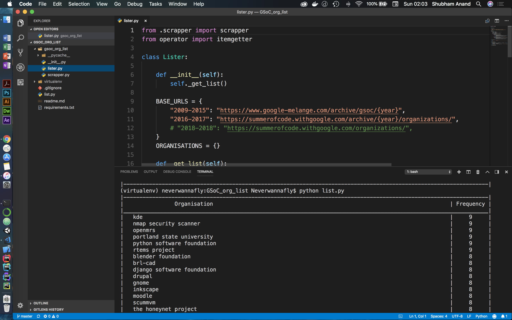

# GSoC Organisations List

## Purpose
This script uses BeautifulSoup Library to generate list of most frequent organizations that have taken part in Google Summer of Code.

## Preview
Below is the preview of application in action
<p align="center">
  
</p>

## Running
Just run the following code from the same directory where Readme.md is

```
python list.py
```
